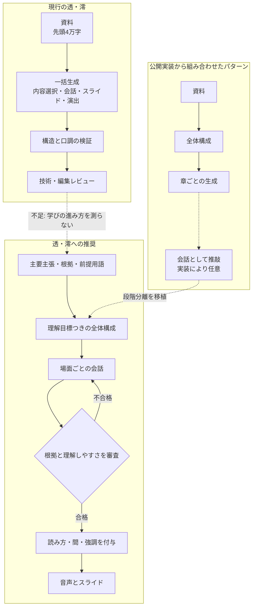

# NotebookLM風音声解説の公開実装調査（OSS・source-available）

## Glossary（この文書で使う固有名詞）

| 用語 | 意味 |
|---|---|
| **Audio Overview** | Google NotebookLMが資料から作る音声解説。Deep Diveでは2人のホストが資料を整理し、関係を結びながら解説する。 |
| **Open Notebook** | 複数資料、1〜4話者、話者プロフィール、台本構成の制御を備えたセルフホスト型NotebookLM代替。 |
| **podcast-creator** | Open Notebookの音声生成を担う独立ライブラリ。全体構成と章別台本を分ける。 |
| **SurfSense** | 資料管理とポッドキャスト生成を備えたオープンソースプロジェクト。生成前に人がbriefを承認できる。 |
| **Podcast-LLM** | 全体構成、質問と回答の反復、小区間の書き直しを明示的に分けたポッドキャスト生成器。非商用ライセンス。 |
| **Podcastfy** | 短尺の一括生成と、長尺の資料分割・逐次生成を備えた音声生成ライブラリ。 |
| **NotebookLlama** | Metaの公開レシピ。台本初稿と音声向けの演出稿を別モデルで作る。 |
| **PDF2Audio** | PDFから会話台本と音声を作るApache-2.0の研究プロトタイプ。内部メモと台本を一度に構造化出力する。 |
| **PodAgent** | Host・Guest・Writerの役割分担と、話者選択・音声表現を研究した学術実装。 |
| **PodEval** | 台本、音声表現、番組全体を分けて評価する研究用の評価枠組み。 |
| **OSS / source-available** | OSSは利用・改変・再配布の自由を認めるライセンスのソフトウェア。source-availableはコードを読めても、非商用などの制限があり、標準的なOSSに含まれないもの。 |
| **学習状態** | 各場面の前後で「視聴者が何を理解できるようになったか」を表す項目。この文書での設計用語で、特定OSSの正式名称ではない。 |
| **場面の問い** | 次の説明を必要にする未解決の疑問。この文書での設計用語で、会話を章見出しの読み上げにしないために置く。 |

## TL;DR (Nugget)

> **今回の主訴に対してNotebookLM風OSSから透・澪へ移植しやすい差は台本工程にあり、構成、章別生成、推敲を分けると展開を制御しやすい。**
>
> **ただし段階を増やすだけでは不十分で、根拠照合と理解しやすさの評価がなければ、冗長さや事実のずれを増やす。**

## 結論: 結局、何をすればいいのか

### 前提となる気づき

1. 透・澪の現行方式は、事実確認、口調、スライド、字幕同期には手厚い。一方、資料の論点整理、教える順番、会話、演出を一度に作らせている。[20–22]
2. 参考になる公開実装は、全体構成を台本と別に保存し、章ごとに前の文脈を渡して書く。音声合成器の違いより、この工程差の方が透・澪へ移植しやすい。[4–11]
3. 調査した公開実装の多くは、根拠の照合、未定義語、理解の飛躍、相槌の多さを診断する専用審査を持たない。ここは模倣ではなく新規に設計する必要がある。[3–17]

### 来週月曜から始める3個のこと

#### (1) 現行台本の品質を数値で残す

- 何をするか: セリフ総文字数、質問数、説明の言い換えだけの返答数、未定義語、資料の主要主張の採用率を記録する。
- なぜか: 現行の3台本は2,210〜2,779字で、仕様にある3,000〜4,500字を下回るが、固定コードは総文字数を検証せずログへ出すだけである。[20,22,23]
- どこから始めるか: 既存3台本を同じ基準で採点し、変更前の表を1枚作る。
- この推奨が崩れる前提: 動画の目標尺を3,000字未満へ正式に変える場合は、文字数の基準を先に仕様とそろえる。

#### (2) 台本より先に「資料理解」と「教える順番」を作る

- 何をするか: 主要主張、根拠箇所、限界、前提用語を持つファイルと、各場面の問い、理解目標、次へ進む理由を持つ構成ファイルを追加する。
- なぜか: Open Notebook、SurfSense、Podcast-LLMは、全体構成を独立させてから小区間を書く。[4–11]
- どこから始めるか: 同じ資料から現行台本と新しい構成だけを作り、人が説明順を比較する。音声工程はまだ変えない。
- この推奨が崩れる前提: 1〜2分の短い動画だけを対象にし、一つの問いと一つの根拠で完結するなら、独立した構成ファイルは省ける。

#### (3) 「技術レビュー」と別に「教え方レビュー」を試す

- 何をするか: 未定義語、根拠のない発言、唐突な接続、重複、長い独白、透の確認だけの返答を診断し、問題のある場面だけ書き直す。
- なぜか: NotebookLlamaの演出用書き直しは自然さを足すが、内容の飛躍を診断しない。PodAgentの比較実験は、役割を分けた生成が一括生成より台本評価を改善できることを示す。[13,18]
- どこから始めるか: 既存台本1本を、診断だけ行う編集者プロンプトへ通し、指摘の妥当性を人が確認する。
- この推奨が崩れる前提: 診断の誤検出が多く、人の修正時間を減らせないなら、自動書き直しは止めて採点表示だけにする。

### その後（週4〜13）の優先順位

- **週4〜5**: 全体構成に沿って場面ごとに会話を生成し、直前の要点と視聴者の理解済み項目だけを引き継ぐ。
- **週6〜7**: 技術的な根拠と、説明順・未定義語・重複を別々に採点し、落ちた場面だけを再生成する。
- **週8〜9**: 内容が確定してから、間、強調、感情、読みを付ける。NotebookLlamaの段階分離を、事実を変えない制約付きで取り入れる。[13]
- **週10〜11**: 同じ3資料で旧方式と新方式を匿名比較し、理解テストと「続きを聞きたいか」を測る。
- **週12〜13**: 改善した場面だけを基に、透の質問パターンと構成の粒度を調整する。

### やらないこと (anti-pattern)

- **フィラーや割り込みだけを増やす**: 自然さの演出は、説明の順序が悪い台本を分かりやすくしない。[13,15]
- **話者を機械的に交互にする**: run-llama版は厳密な交互発話を検証するが、役割に応じた長さや質問の必要性までは保証しない。[16]
- **資料を先頭から分割した順に話す**: Podcastfyの長尺方式は局所的なつながりを保てるが、教材としての順番を先に設計しない。[14]
- **Podcast-LLMのコードをそのまま商用利用する**: CC BY-NC 4.0なので、採用するのは考え方に留め、コード流用はライセンスを別途確認する。[10]

### 検証指標

以下は実測後に調整する暫定合格線である。

- **理解**: 5問の内容確認で、新方式の正答率が旧方式より10ポイント以上高い。
- **視聴意向**: 話者名を隠した比較で、10人以上の70%以上が新方式を「続きを聞きたい」と選ぶ。
- **台本品質**: 未定義語と根拠のない主張を0件にし、透の確認だけの返答を透の全発話の25%以下へ抑える。

## 問い

NotebookLM風の公開実装は、分かりやすい二人語りをどの工程・設計で作っており、そのうち透・澪へ移植価値が高い仕組みは何か。

読者: audio-summary-uploaderの台本生成方式を改善する開発者。

## 全体マップ

現行方式にも初稿と最終審査の二段階はある。しかし初稿が、資料の選択、説明順、人物会話、スライド、読み、表情、動画メタデータまで一括で決めるため、最終審査は完成済みの大きなJSONを書き直す形になる。[21,22]

公開実装から移植すべきなのは、工程数そのものではなく、各工程が別の成果物と合格条件を持つ設計である。資料理解では根拠を落とさない。全体構成では学びの順番を決める。場面生成では会話にする。最終段階では内容を変えず、読み方だけを整える。

## 論点ごとの分析

### 論点1: NotebookLMの見える品質と、見えない実装を分ける

Googleの公開説明から確認できるのは、Deep Diveが2人のホストで資料を整理し、論点間の関係を結び、会話として提示すること、さらに利用者が焦点、対象者、長さなどを指定できることまでである。[1,2] 内部のプロンプト、モデル構成、段階数、評価器は公開されていない。したがって、OSSのREADMEで「NotebookLM風」と書かれていても、Googleの内部方式を再現した証拠にはならない。

**反例**: 出力の見た目だけなら、強い一発プロンプトと高品質な音声合成でもNotebookLMらしい会話は作れる。gabrielchua版は、強い導入、徐々に複雑にする、理解の休憩、自然な要点再提示を一つのプロンプトへ詰め、二稿目で自然さを上げる。[15]

**含意**: NotebookLMのプロンプト当てを目標にせず、「説明順を制御できる」「根拠を追える」「失敗箇所だけ直せる」という検証可能な設計を採る。

### 論点2: 実装は六つの型に分かれる

| 型 | 主な実装 | 台本工程 | 前の文脈 | 専用の内容審査 | 透・澪への価値 |
|---|---|---|---|---|---|
| 一括生成 | PDF2Audio、PageLM、run-llama版 | 資料から構造化会話を一度に生成 | なし | なし | プロンプトの部品だけ参考 |
| 一括生成＋汎用書き直し | gabrielchua版 | 初稿→「自然で魅力的に」書き直し | 初稿全体 | なし | hook、複雑さの段階、短い発話 |
| 資料分割＋逐次生成 | Podcastfy | 資料chunkごとに会話を追加 | 既生成会話全体 | 話者タグ修正のみ | 長文の継続方法 |
| 全体構成＋章別生成 | Open Notebook、SurfSense | outline→segment transcript | 全体構成＋直前までの台本または要約 | JSON検証のみ | 本命となる基本構造 |
| 全体構成＋質問回答＋推敲 | Podcast-LLM | outline→質問役と回答役で小区間生成→Writer | 会話履歴と関連資料 | 会話の推敲はあるが根拠criticは弱い | 質問役と編集役の分離 |
| 内容稿＋演出稿 | Meta NotebookLlama | 台本初稿→音声向けの演出書き直し | 初稿全体 | なし | 内容確定後の音声演出 |

Open Notebookの基盤は、全体のoutlineを先にJSON化し、各segmentを順番に生成する。各章の生成時には全体構成と既生成台本を渡し、話者プロフィールに沿った意味のある貢献を求める。[4–6] SurfSenseはさらに、言語、形式、話者、尺、焦点を人が承認してから、尺を語数へ変換してoutlineを作り、各segmentへ直前会話の末尾800文字を渡す。[7–9]

Podcast-LLMは、outlineの小節ごとに質問役と回答役を別呼び出しし、回答時に関連する資料4chunkを検索する。最後に初稿を4要素ずつ書き直すため、質問の展開と会話の仕上げが分離している。[10,11] 今回確認した中では工程が細かいが、公開コードの最終書き直しは自然さと流れが中心で、各主張を根拠へ戻して判定する処理ではない。

**反例**: 工程が少なくても、対象が短く資料が単純なら十分である。PDF2Audioは用語定義、背景、類推、具体例を内部メモで考えさせ、人が台本へフィードバックして再生成できる。[12] 一方、「資料にない隙間を想像で埋める」という指示は、技術解説では採用しにくい。また、誤ったoutlineを先に固定すると後段すべてへ誤りが広がり、章別生成は章間の重複や声色のずれを生みうる。段階数に応じて生成時間も増える。

**含意**: Open Notebook型の全体構成と章別生成を土台にし、SurfSenseの尺設計、Podcast-LLMの質問役と編集役、NotebookLlamaの演出分離を必要な範囲だけ組み合わせる。

### 論点3: 透は「相槌役」ではなく、理解を前進させる役にする

現行プロンプトは、透を初心者の聞き役と定め、説明の飛躍を見つけるよう求めている。[21] しかし最新の実例では透の26発話中、澪へ明確に問いを投げる発話は3つで、多くは澪の説明や数値の言い換えになっている。[23] 「つまり」「なるほど」「〜なのですね」が続くと、視聴者がどこでつまずくかを代弁するより、澪の説明を確認する役になりやすい。

役割は話し方ではなく、場面ごとの仕事として指定するとよい。透には、予想する、誤解する、反例を出す、前提語を尋ねる、新しい例へ当てはめる、のいずれかを持たせる。澪には、その反応を受けて説明を一段戻す、例を変える、限界を示す、を持たせる。PodAgentはHost、複数Guest、Writerを分け、直接GPT-4で生成する方式より内容評価を改善したと報告している。[18]

**反例**: 毎場面で透に誤解や反論をさせると、会話が芝居がかり、説明が遅くなる。すでに理解済みの箇所では短い確認を許し、確認だけの返答が全体を占めないよう比率で管理する方がよい。

**含意**: 各場面の構成に「透が起こす認知イベント」と「場面後に理解できること」を一つずつ持たせる。厳密な交互発話ではなく、必要な役割が果たされたかを検証する。

### 論点4: 現行方式は品質審査が弱いのではなく、審査対象が遅すぎる

現行はClaude Opusで初稿を作り、固定コードで8〜14シーン、各2〜6発話、80字以内、話者、表情、スライド項目などを検証し、Codexが元資料と初稿を受けて技術・編集面を審査する。[20–22] 事実、公開安全性、形式については、多くのOSSより強い。

問題は、理解しやすさを決める全体構成が独立成果物ではないことにある。レビューも完成済みJSONを対象とし、説明順の基準は固定の章立てである。構成段階で「なぜ次へ進むのか」「前提語が説明済みか」「資料のどの根拠を使うか」を検査できない。[21,22]

最小構成では、次の二つを台本と別に保存すればよい。

| 成果物 | 必須項目 | 合格条件 |
|---|---|---|
| 資料理解 | 中心の問い、一文の答え、主要主張、根拠箇所、限界、前提用語 | すべての主要主張に根拠があり、使う用語の前提が列挙されている |
| 教える順番 | 各場面の問い、場面前後の理解、使う主要主張、次へ進む理由、透の役割、目標文字数 | 根拠のない場面がなく、前提語を使う前に説明し、同じ理解目標を重ねていない |

場面生成はこの二つと直前場面の要約を入力にし、台本を出力する。教え方レビューは上の合格条件に加え、未定義語、唐突な接続、重複、長い独白、確認だけの返答を数え、一つでも重大な違反があれば該当場面だけを再生成する。ここでいう「未定義語」は、前提用語にあるのに、それ以前のセリフやスライドで平易な説明がない語である。主要主張の採用率は、台本が参照した主要主張の数を、資料理解にある必須の主要主張数で割って求める。

加えて、仕様にはセリフ合計3,000〜4,500字をPythonとスキーマで強制するとあるが、現在の検証関数には総文字数の判定がなく、完成後にログへ出すだけである。[20,22] 保存済み3台本は2,210字、2,327字、2,779字で、すべて下限未満だった。[23] これは分かりにくさの原因を直接証明しないが、仕様上想定した説明量と実出力がずれている。

**反例**: 文字数を増やすだけでは理解は改善しない。未定義語、反復、余談が増えれば逆効果である。

**含意**: まず仕様と検証のずれを直し、その後に構成を独立させる。審査を増やすのではなく、資料理解、全体構成、場面、音声演出の各段階で、少数の明確な合格条件を置く。

### 論点5: 台本評価と音声評価を分ける

NotebookLlamaは、情報を含む初稿を大きなモデルで作り、別モデルで割り込み、笑い、間、強調などを加えてから、話者別の音声合成へ渡す。[13] この分離は有用だが、演出稿が内容を変えない保証は弱い。透・澪では、内容稿を確定した後に、読み、間、強調、表情だけを付ける制約が必要である。

PodEvalは、台本内容、話し方、番組全体の聞き心地を別々に評価する。研究報告では、NotebookLMは対話自然さで実在ポッドキャストに次いだ。一方、全編聴取意向は全方式で低く、NotebookLMと実在ポッドキャストは同程度だった。単文ごとの音声合成は対話の自然さを損なう可能性も示された。[19]

**反例**: 今回の主訴は内容と展開であり、最初から音声モデルを入れ替えると原因を切り分けにくい。

**含意**: 最初の比較実験では同じ音声合成を使い、台本工程だけを変える。台本の改善が確認できてから、音声演出を別の実験として評価する。

## 残された空白（誠実な開示）

- **NotebookLMの内部方式**: Googleは出力形式とカスタマイズ項目を公開しているが、台本生成の内部工程は公開していない。OSSとの一致は検証できない。[1,2]
- **同一資料での音声比較**: 今回は一次コードと保存済み透・澪台本を比較した。各OSSを同じ日本語資料と同じ音声で実行する聴取実験はまだ行っていない。
- **日本語対話の韻律**: 句読点、無音長、相槌の重なりが理解へ与える影響は、台本だけでは測れない。台本改善後に音声A/Bが必要である。[19]
- **ライセンスと保守性**: 実装アイデアの調査が中心で、依存関係の脆弱性や長期保守コストまでは監査していない。Podcast-LLMは非商用、PageLMはcommunity licenseである。[6,17]
- **外部レビューの制約**: この環境ではGeminiとClaudeの認証が利用できなかった。公開一次資料、複数の独立したコード読解、読者目線レビューで補ったが、異なるモデルによる概念レビューは未実施である。

## 参照文献

[1] Google. NotebookLM Help: Generate Audio Overview. 2026. https://support.google.com/notebooklm/answer/16212820 [2] Google. NotebookLM Audio Overviews. 2024. https://blog.google/innovation-and-ai/products/notebooklm-audio-overviews/ [3] lfnovo. Open Notebook. https://github.com/lfnovo/open-notebook [4] lfnovo. podcast-creator graph.py. https://github.com/lfnovo/podcast-creator/blob/main/src/podcast_creator/graph.py [5] lfnovo. podcast-creator outline.jinja. https://github.com/lfnovo/podcast-creator/blob/main/prompts/podcast/outline.jinja [6] lfnovo. podcast-creator transcript.jinja. https://github.com/lfnovo/podcast-creator/blob/main/prompts/podcast/transcript.jinja [7] MODSetter. SurfSense podcast specification and service. https://github.com/MODSetter/SurfSense/tree/main/surfsense_backend/app/podcasts [8] MODSetter. SurfSense plan_outline.py. https://github.com/MODSetter/SurfSense/blob/main/surfsense_backend/app/podcasts/generation/prompts/plan_outline.py [9] MODSetter. SurfSense draft_segment.py. https://github.com/MODSetter/SurfSense/blob/main/surfsense_backend/app/podcasts/generation/prompts/draft_segment.py [10] Evan Dempsey. Podcast-LLM generate.py and outline.py. https://github.com/evandempsey/podcast-llm/tree/main/podcast_llm [11] Evan Dempsey. Podcast-LLM writer.py. https://github.com/evandempsey/podcast-llm/blob/main/podcast_llm/writer.py [12] Lam Research Group, MIT. PDF2Audio app.py. https://github.com/lamm-mit/PDF2Audio/blob/main/app.py [13] Meta. NotebookLlama recipe. https://github.com/meta-llama/llama-cookbook/tree/main/recipes/quickstart/NotebookLlama [14] Tharindu N. souzatharsis/Podcastfy content generation and conversation config. https://github.com/souzatharsis/podcastfy/tree/main/podcastfy [15] Gabriel Chua. open-notebooklm prompts.py and utils.py. https://github.com/gabrielchua/open-notebooklm [16] run-llama. notebookllama audio.py. https://github.com/run-llama/notebookllama/blob/main/src/notebookllama/audio.py [17] CaviraOSS. PageLM. https://github.com/CaviraOSS/PageLM [18] Xiao, Y. et al. PodAgent: A Comprehensive Framework for Podcast Generation. Findings of ACL 2025. https://aclanthology.org/2025.findings-acl.1226/ [19] Xiao, Y. et al. PodEval: A Multimodal Evaluation Framework for Podcast Audio Generation. 2025. https://arxiv.org/abs/2510.00485 [20] audio-summary-uploader. Lecture specification, section 3.2. ../specs/LECTURE_SPEC.md [21] audio-summary-uploader. Current lecture script prompt and review prompt. ../src/lecture/prompts/lecture_script.md [22] audio-summary-uploader. Current script generation and validation. ../src/lecture/script_gen.py [23] audio-summary-uploader. Saved script samples, 2026-07-22 to 2026-07-23. ../tmp/lecture-debug/
